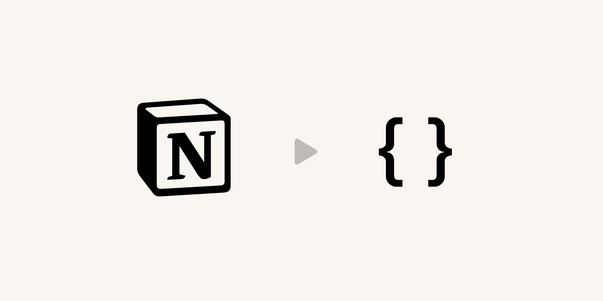

> Fetch Notion Pages as JSON

[](https://www.npmjs.org/package/notion-to-json)
[](https://github.com/neogeek/notion-to-json/actions/workflows/test.workflow.yml)

## Install

```bash
$ npm install notion-to-json --save
```

## Setup

Create integration at <https://www.notion.so/my-integrations/> and use the **Internal Integration Token** when requesting pages.

## Usage

```typescript
import { getPageSimple } from 'notion-to-json';

(async () => {
  const page = await getPageSimple('xxxxxxxx-xxxx-xxxx-xxxx-xxxxxxxxxxxx', {
    api_key: 'secret_xxxxxxxxxxxx'
  });

  console.log(page.title);
  console.log(page.blocks);
})();
```

### Next.js

```typescript
import type { NextPage } from 'next';
import Head from 'next/head';

import sanitizeHtml from 'sanitize-html';

import { getPageSimple } from 'notion-to-json';
import { SupportedBlockTypes } from 'notion-to-json/dist/types';

export async function getStaticProps() {
  const page = await getPageSimple('xxxxxxxx-xxxx-xxxx-xxxx-xxxxxxxxxxxx', {
    api_key: 'secret_xxxxxxxxxxxx'
  });

  return {
    props: {
      page
    }
  };
}

const Block = ({
  block
}: {
  block: { type: string; contents: string | string[] };
}) => {
  const SimpleBlockTags = Object.freeze({
    [SupportedBlockTypes.paragraph]: 'p',
    [SupportedBlockTypes.heading_1]: 'h1',
    [SupportedBlockTypes.heading_2]: 'h2',
    [SupportedBlockTypes.heading_3]: 'h3',
    [SupportedBlockTypes.quote]: 'blockquote',
    [SupportedBlockTypes.callout]: 'div'
  });

  if (SimpleBlockTags[block.type]) {
    const BlockTag = `${
      SimpleBlockTags[block.type]
    }` as keyof JSX.IntrinsicElements;

    return (
      <BlockTag
        dangerouslySetInnerHTML={{
          __html: sanitizeHtml(
            Array.isArray(block.contents)
              ? block.contents.join('\n')
              : block.contents
          )
        }}
      />
    );
  } else if (
    block.type === SupportedBlockTypes.bulleted_list_item ||
    block.type === SupportedBlockTypes.numbered_list_item
  ) {
    const BlockTag = `${
      block.type === SupportedBlockTypes.numbered_list_item ? 'ol' : 'ul'
    }` as keyof JSX.IntrinsicElements;

    return (
      <BlockTag>
        {Array.isArray(block.contents) &&
          block.contents.map((item, index) => (
            <li
              key={index}
              dangerouslySetInnerHTML={{
                __html: sanitizeHtml(item)
              }}
            />
          ))}
      </BlockTag>
    );
  } else if (block.type === SupportedBlockTypes.image) {
    return ;
  }

  return null;
};

const NotionPage: NextPage<{
  page: {
    title: string;
    blocks: {
      type: string;
      contents: string | string[];
    }[];
  };
}> = ({ page }) => {
  return (
    <div>
      <Head>
        <title>{page.title}</title>
      </Head>

      <h1>{page.title}</h1>

      <>
        {page.blocks.map((block, index) => {
          return <Block block={block} key={index} />;
        })}
      </>
    </div>
  );
};

export default NotionPage;
```
